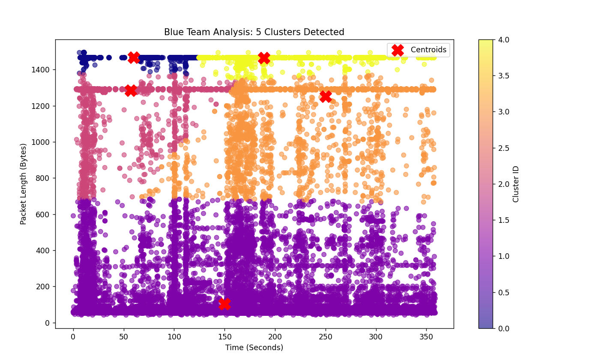

# 🛡️ AI-Powered Network Anomaly Detection using K-Means

## 📖 Project Overview
This project demonstrates how **Unsupervised Machine Learning** can be applied to **Blue Team** operations. By using the **K-Means Clustering** algorithm, we analyze network traffic to automatically establish a baseline and detect security anomalies (outliers) that could indicate malicious activity like unauthorized data transfers or scanning.

---

## 🚀 Key Features
* **Real-World Data:** Analyzes traffic captured directly from **Wireshark**.
* **AI Implementation:** Uses **Scikit-learn** to perform automated clustering.
* **Interactive Visualization:** Generates scatter plots showing traffic groups and centroids.
* **Threat Hunting:** Helps identify suspicious packets (like TLS spikes) that deviate from the normal baseline.

---

## 🛠️ Step-by-Step Guide: How to Capture Data

To use this project with your own network data, follow these steps in **Wireshark**:

### 1. Start Capture
* Open Wireshark and select your active interface (Wi-Fi or Ethernet).
* Click the **Blue Shark Fin** icon to start live capturing.

### 2. Create a Baseline
* Perform normal activities (browsing, streaming, work) for 5-10 minutes so the AI can learn what "Normal" looks like.

### 3. Export to CSV
* Click the **Red Stop Button**.
* Go to **File > Export Packet Dissections > As CSV...**
* Select **"All packets"** and save the file as `test_cap.csv` in your project folder.

---

## 💻 How to Run the Project

The Python script (`kmeans_script.py`) automatically **fetches** data from your `test_cap.csv` file.

### **Prerequisites**
Install the necessary Python libraries:
```bash
(pip install pandas scikit-learn matplotlib

###**Execution
Open your terminal/CMD in the project directory and run:

###**Bash
python kmeans_script.py test_cap.csv
)


---

## 📊 Results & Visualization
The AI successfully groups thousands of packets into clusters. Below is the visual representation of the analysis:



> **Note:** Isolated data points (Outliers) far from the centroids represent anomalies that a SOC Analyst must investigate.

---
